# PDF to Markdown Converter

Intelligent PDF to Markdown converter with vision-based table detection and automatic strategy selection.

## What This Does

Converts PDF documents to clean, well-structured Markdown files with:

1. **Vision-based table detection** - Analyzes first 5 pages using AI vision model
2. **Smart routing** - Automatically selects best converter based on content:
   - **PyMuPDF4LLM** (free, fast) for simple documents
   - **OpenAI Vision API** (accurate, paid) for documents with complex tables
3. **Page number markers** - Adds `<!-- Page N -->` comments for easy reference
4. **Parallel processing** - Converts multiple PDFs simultaneously
5. **Complete logging** - Timestamped logs with full audit trail

---

## Visual Flow Diagrams

### High-Level Process Overview


### Detailed Library Interaction Flow

```mermaid
flowchart TB
    subgraph Input
        PDF[PDF File]
    end

    subgraph "Phase 1: Vision-Based Detection"
        P2I[pdf2image<br/>Convert pages 1-5<br/>to PIL Images<br/>200 DPI]

        TF[transformers<br/>Load table-transformer<br/>-detection model<br/>~240MB]

        Resize[pillow<br/>Downscale if > 1800px]

        Detect[torch + transformers<br/>Run object detection<br/>Get bounding boxes<br/>+ confidence scores]

        Filter{Filter<br/>label=table<br/>score >= 0.90}

        Decision{Any tables<br/>detected?}

        PDF --> P2I
        P2I --> TF
        TF --> Resize
        Resize --> Detect
        Detect --> Filter
        Filter --> Decision
    end

    subgraph "Phase 2A: PyMuPDF Route"
        PML[pymupdf4llm<br/>IdentifyHeaders]

        PMC[pymupdf4llm<br/>to_markdown<br/>page_chunks=True]

        Extract[Extract page chunks<br/>with metadata]

        Process[Post-process:<br/>- Add page markers<br/>- Remove ** markers<br/>- Convert to headings]

        Decision -->|No Tables| PML
        PML --> PMC
        PMC --> Extract
        Extract --> Process
    end

    subgraph "Phase 2B: OpenAI Route"
        Open[pymupdf<br/>Open PDF<br/>Get page count]

        Chunk[Split into<br/>5-page chunks]

        Render[pymupdf<br/>Render each page<br/>to PNG 150 DPI]

        B64[base64<br/>Encode to base64]

        Build[Build message:<br/>- Text prompt<br/>- Page numbers<br/>- All images]

        API[openai<br/>gpt-4o-mini<br/>Vision API]

        Track[Track tokens<br/>Calculate cost]

        Combine[Combine chunks]

        Decision -->|Has Tables| Open
        Open --> Chunk
        Chunk --> Render
        Render --> B64
        B64 --> Build
        Build --> API
        API --> Track
        Track --> Combine
    end

    subgraph Output
        Write[Write to<br/>output_path]
        MD[Markdown File<br/>with page markers]
        Log[Logger<br/>Log results]
    end

    Process --> Write
    Combine --> Write
    Write --> MD
    Write --> Log

    style "Phase 1: Vision-Based Detection" fill:#e3f2fd
    style "Phase 2A: PyMuPDF Route" fill:#f1f8e9
    style "Phase 2B: OpenAI Route" fill:#fff3e0
    style Output fill:#fce4ec
```

### Decision Tree

```mermaid
graph TD
    Start([PDF Document]) --> Scan[Scan First 5 Pages]

    Scan --> Convert[pdf2image: PDF → Images]
    Convert --> Model[Vision Model Analysis]

    Model --> Check{Table Detection<br/>Score >= 0.90?}

    Check -->|Yes| HasTable[✓ Tables Detected]
    Check -->|No| NoTable[✗ No Tables]

    HasTable --> RouteA[Route to OpenAI Vision API]
    NoTable --> RouteB[Route to PyMuPDF4LLM]

    RouteA --> CostA[Cost: ~$0.004/page<br/>Speed: 2-3 sec/page<br/>Quality: Excellent tables]
    RouteB --> CostB[Cost: Free<br/>Speed: < 1 sec/PDF<br/>Quality: Clean text]

    CostA --> OutputA[Markdown with<br/>preserved tables<br/>+ page markers]
    CostB --> OutputB[Markdown with<br/>clean formatting<br/>+ page markers]

    OutputA --> Done([data/output/file.md])
    OutputB --> Done

    style HasTable fill:#ffcdd2
    style NoTable fill:#c8e6c9
    style RouteA fill:#ffe0b2
    style RouteB fill:#b2dfdb
    style Done fill:#e1bee7
```



### Parallel Processing Architecture


---

## Libraries Used and Their Roles

### 1. Table Detection Libraries

#### `transformers` (Hugging Face)
**What**: Machine learning library for vision transformer models
**Role**: Provides the object-detection pipeline
**Process**:
- Loads microsoft/table-transformer-detection model (~240MB)
- Runs inference on PDF page images to detect table bounding boxes
- Returns confidence scores and coordinates for detected tables

#### `torch` (PyTorch)
**What**: Deep learning framework
**Role**: Backend for transformer model
**Process**:
- Manages GPU/CPU computation
- Handles model weights and tensors
- Provides autocast for faster inference

#### `pdf2image` + `pillow`
**What**: PDF to image conversion library
**Role**: Converts PDF pages to PIL Image objects
**Process**:
- Renders PDF pages at 200 DPI
- Downscales images > 1800px width for efficiency
- Feeds images to vision model for analysis

#### `timm` (PyTorch Image Models)
**What**: Image model library
**Role**: Required dependency for table-transformer model
**Process**: Provides backbone architectures for the DETR-based detector

### 2. Conversion Libraries

#### `pymupdf4llm`
**What**: Specialized PDF to Markdown converter
**Role**: Fast, free converter for simple documents
**Process**:
1. Opens PDF with PyMuPDF backend
2. Identifies headers using `IdentifyHeaders()` helper
3. Extracts text with multi-column layout awareness
4. Splits into page chunks with metadata
5. Returns markdown with preserved structure

#### `pymupdf` (PyMuPDF/fitz)
**What**: Low-level PDF manipulation library
**Role**: PDF reading and image rendering
**Process**:
- Opens and parses PDF structure
- Extracts page dimensions and content
- Renders pages to PNG images (150 DPI) for OpenAI
- Encodes images to base64 for API transmission

#### `openai` (OpenAI Python SDK)
**What**: Official OpenAI API client
**Role**: Sends images to Vision API for conversion
**Process**:
1. Encodes page images as base64 PNG
2. Builds multi-modal message with text prompt + images
3. Sends to gpt-4o-mini Vision API in 5-page chunks
4. Receives markdown text with preserved tables
5. Tracks token usage and calculates costs

### 3. Processing & Utilities

#### `concurrent.futures.ThreadPoolExecutor`
**What**: Python standard library for parallel execution
**Role**: Manages parallel PDF conversion
**Process**:
- Creates thread pool with MAX_WORKERS threads (default: 4)
- Submits conversion tasks for each PDF
- Collects results as they complete
- Handles exceptions without stopping batch

#### `python-dotenv`
**What**: Environment variable loader
**Role**: Loads configuration from .env file
**Process**:
- Reads `.env` file at startup
- Loads API keys and settings into environment variables
- Provides configuration to all modules

---

## Complete Process Flow

### Phase 1: Table Detection (Sequential)

```
For each PDF:
  1. pdf2image: Convert first 5 pages to PIL Images (200 DPI)
  2. transformers: Load table-transformer-detection model (once, cached)
  3. torch: Downscale images > 1800px width
  4. transformers: Run object detection on each image
  5. Filter detections with label="table" and score >= 0.90
  6. Decision:
     - If ANY table found → route to "openai"
     - If NO tables found → route to "pymupdf"
  7. Store result: {has_tables, decision, pdf_path, output_path}
```

### Phase 2: Conversion (Parallel)

#### Route A: PyMuPDF4LLM (Simple Documents)

```
ThreadPool executes in parallel:
  1. pymupdf4llm: Call IdentifyHeaders(pdf_path)
  2. pymupdf4llm: Call to_markdown(pdf_path, hdr_info, page_chunks=True)
  3. For each chunk:
     - Extract page number from metadata
     - Add "<!-- Page N -->" marker
     - Extract text content
  4. Post-process markdown:
     - Remove all ** bold markers
     - Convert all-caps bold lines to ## headings
     - Convert title-case bold lines to ### headings
  5. Write to output_path
```

#### Route B: OpenAI Vision (Table-Heavy Documents)

```
ThreadPool executes in parallel:
  1. pymupdf: Open PDF and get total page count
  2. Calculate chunks (5 pages per chunk)
  3. For each chunk:
     a. For each page in chunk:
        - pymupdf: Render page to PNG (150 DPI)
        - base64: Encode image to base64 string
        - Build image_url object
     b. Build message with:
        - Text prompt with page numbers and instructions
        - All images in sequential order
     c. openai: Send to gpt-4o-mini Vision API
     d. Receive markdown response
     e. Track token usage (prompt_tokens + completion_tokens)
  4. Combine all chunk responses
  5. Write to output_path
  6. Calculate cost: (input_tokens × $0.15 + output_tokens × $0.60) / 1M
```

---

## Architecture

### SOLID Design

```
src/
├── converters/
│   ├── base.py                    # BaseConverter interface
│   ├── pymupdf_converter.py       # PyMuPDF4LLM implementation
│   └── openai_converter.py        # OpenAI Vision implementation
├── processors/
│   └── pdf_processor.py           # PDFProcessor orchestrator
├── detector.py                    # TableDetector (vision-based)
└── logger.py                      # ConsoleLogger

main.py                            # Entry point (dependency injection)
```

**Key principles:**
- **Single Responsibility**: Each class has one job
- **Open/Closed**: Easy to add new converters (inherit BaseConverter)
- **Dependency Injection**: Processors receive converters via constructor
- **Interface Segregation**: Clean BaseConverter interface
- **Loose Coupling**: Components communicate through interfaces

---

## Usage

### Prerequisites

- Docker and Docker Compose installed
- OpenAI API key (for documents with tables)

### Quick Start

1. **Add OpenAI API key** to `.env`:
```bash
OPENAI_API_KEY=sk-your-key-here
```

2. **Place PDF files** in `data/raw_docs/`

3. **Run the converter**:
```bash
docker-compose run --rm pdf-converter
```

4. **Find converted markdown** in `data/output/`

5. **Check logs** in `logs/conversion_YYYYMMDD_HHMMSS.log`

---

## Configuration

Edit `.env` to customize:

```bash
# OpenAI Configuration
OPENAI_API_KEY=sk-your-key-here
OPENAI_MODEL=gpt-4o-mini

# Table Detection Settings
TABLE_MIN_COLS=3              # Minimum columns for valid table
TABLE_MIN_ROWS=5              # Minimum rows for valid table
TABLE_MIN_ACCURACY=90.0       # Confidence threshold (0-100)
TABLE_SCAN_PAGES=5            # Pages to scan for detection

# Parallel Processing
MAX_WORKERS=4                 # Parallel conversion threads

# OpenAI Processing
OPENAI_CHUNK_SIZE=5           # Pages per Vision API request
```

---

## Example Output

### Console Output

```
📝 Logging to: /app/logs/conversion_20251029_202359.log
============================================================
📂 Found 3 PDF file(s)
============================================================

🔍 Phase 1: Detecting tables...

  Analyzing: Document1.pdf
    → Tables: False | Strategy: PYMUPDF
  Analyzing: Document2.pdf
    → Tables: False | Strategy: PYMUPDF
  Analyzing: ClosingStatement.pdf
    → Tables: True | Strategy: OPENAI

🚀 Phase 2: Converting documents in parallel...
============================================================

============================================================
📄 Converting: Document1.pdf
============================================================
🎯 Strategy: PYMUPDF
⚙️  Using: PyMuPDF4LLM
🔄 Converting...
✅ Success: Document1.md

============================================================
📄 Converting: ClosingStatement.pdf
============================================================
🎯 Strategy: OPENAI
⚙️  Using: OpenAI (gpt-4o-mini)
🔄 Converting...
   📄 Total pages: 14
   🔢 Processing in chunks of 5 pages
   👁️  Using Vision API (auto detail mode)
   📦 Total chunks: 3
   🔄 Chunk 1/3: Pages 1-5
   🔄 Chunk 2/3: Pages 6-10
   🔄 Chunk 3/3: Pages 11-14
   📊 Total tokens: 357652 in, 6323 out
   💰 Total cost: $0.0574
✅ Success: ClosingStatement.md

############################################################
📋 PROCESSING SUMMARY
############################################################
✅ Document1.pdf
   Tables: No | Converter: PyMuPDF4LLM
✅ Document2.pdf
   Tables: No | Converter: PyMuPDF4LLM
✅ ClosingStatement.pdf
   Tables: Yes | Converter: OpenAI (gpt-4o-mini)

────────────────────────────────────────────────────────────
Total: 3 | Success: 3 | Failed: 0
############################################################
```

### Markdown Output

```markdown
<!-- Page 1 -->

## SETTLEMENT STATEMENT

### Property Information
3810 Law Street, Houston, TX 77005

| Description | Buyer Charge | Buyer Credit |
|-------------|--------------|--------------|
| Total Consideration | 62,900,000.00 |  |
| First Deposit |  | 314,500.00 |
| Second Deposit | 5,114.04 |  |

<!-- Page 2 -->

## TITLE CHARGES

### Escrow Fees

| Description | Amount |
|-------------|--------|
| Escrow Fee | 1,000.00 |
| Survey Amendment | 20,985.55 |
```

---

## Performance & Cost

### Detection Performance
- **Time**: 1-2 seconds per PDF
- **Model**: microsoft/table-transformer-detection (~240MB)
- **Accuracy**: 90% confidence threshold (no false positives)

### Conversion Performance

| Converter | Speed | Cost |
|-----------|-------|------|
| PyMuPDF4LLM | < 1 sec/PDF | Free |
| OpenAI Vision | ~2-3 sec/page | $0.004/page |

### Cost Estimates (OpenAI Vision)

**Pricing:**
- Input: $0.15 per 1M tokens
- Output: $0.60 per 1M tokens

**Examples:**
- 14-page PDF with tables: $0.0574
- 50-page PDF with tables: ~$0.20
- 100-page PDF with tables: ~$0.40
- 1,000 documents (avg 50 pages, 20% with tables): ~$40

**Optimization:**
- Only processes documents with detected tables
- 5-page chunks for optimal Vision API efficiency
- Auto detail mode balances cost vs quality

---

## Logging

All conversions logged to `logs/conversion_YYYYMMDD_HHMMSS.log` with:

- Detection results and strategy decisions
- Conversion progress (chunk by chunk)
- Token usage and costs (OpenAI)
- Success/failure status
- Error details with stack traces
- Complete processing timeline

---

## Dependencies

### Core Libraries

```
# Table Detection (vision-based)
pdf2image>=1.16.0              # PDF to image conversion
pillow>=10.0.0                 # Image processing
torch>=2.0.0                   # PyTorch backend
torchvision>=0.15.0            # Vision utilities
transformers>=4.40.0           # Hugging Face models
timm>=0.9.0                    # Image model architectures

# Converters
pymupdf>=1.23.0                # PDF parsing and rendering
pymupdf4llm>=0.0.1             # Markdown conversion
openai>=1.12.0                 # OpenAI API client

# Utilities
python-dotenv>=1.0.0           # Environment configuration
```

### System Requirements

- Python 3.11
- Docker (recommended)
- 2GB RAM minimum
- 500MB disk space (for model cache)

---

## Why This Approach?

### Problem Solved

Traditional PDF converters struggle with:
- **False positives**: Multi-column text detected as tables
- **Text duplication**: Poor multi-column handling
- **Cost inefficiency**: Using expensive AI for simple documents
- **Table accuracy**: Free tools mangle complex tables

### Solution

1. **Vision-based detection** (microsoft/table-transformer)
   - Analyzes PDF pages as images
   - High accuracy (90% threshold)
   - No false positives on multi-column layouts

2. **Intelligent routing**
   - Simple documents → PyMuPDF4LLM (free, fast, clean)
   - Complex tables → OpenAI Vision (accurate, paid)

3. **Cost optimization**
   - Only first 5 pages scanned for detection
   - Only table-heavy documents use OpenAI
   - 5-page chunks for Vision API efficiency

4. **Quality output**
   - Page number markers for reference
   - Clean formatting (no excessive bold)
   - Proper heading hierarchy
   - Preserved table structures

---

## Docker Setup

### Dockerfile

```dockerfile
FROM python:3.11-slim

# Install system dependencies for pdf2image and PyTorch
RUN apt-get update && apt-get install -y \
    ghostscript \
    poppler-utils \
    libgl1 \
    libglib2.0-0 \
    && rm -rf /var/lib/apt/lists/*

WORKDIR /app
COPY requirements.txt .
RUN pip install --no-cache-dir -r requirements.txt
COPY . .

CMD ["python", "main.py"]
```

### Docker Compose

```yaml
services:
  pdf-converter:
    build: .
    volumes:
      - ./data:/app/data
      - ./logs:/app/logs
    env_file:
      - .env
```

**Volumes:**
- `./data:/app/data` - Input PDFs and output markdown
- `./logs:/app/logs` - Conversion logs (persistent)

---

## License

Proof-of-concept project for intelligent PDF to Markdown conversion.
