# RAG Pipeline Architecture Flow

## Models Used

| Component | Model | Purpose |
|-----------|-------|---------|
| **Embedding Model** | `sentence-transformers/all-MiniLM-L6-v2` | Generate 384-dim vectors for semantic search |
| **NER Model** | `spaCy en_core_web_md` | Extract named entities (persons, locations, orgs, dates) |
| **Vector DB** | Milvus (L2 distance) | Store and search embeddings |

---

## 1. INGESTION FLOW


### Ingestion Data Structure
```
Chunk = {
    document_id: string,
    file_hash: string (SHA256),
    page_number: int,
    text: string,
    embedding: float[384],           ← Sentence Transformer
    person_names: JSON string,       ← spaCy (lowercase)
    location_names: JSON string,     ← spaCy (lowercase)
    organization_names: JSON string, ← spaCy (lowercase)
    date_entities: JSON string,      ← spaCy (lowercase)
    other_entities: JSON string      ← spaCy (lowercase)
}
```

---

## 2. HYBRID RETRIEVAL FLOW (Two Parallel Scenarios)

```mermaid
flowchart TD
    Query([🔍 User Query]) --> Parallel{Run Both Scenarios<br/>in Parallel}

    %% Scenario 1: Direct Semantic
    Parallel --> S1[Scenario 1:<br/>Direct Semantic]
    S1 --> S1_Embed[Step 1: 🤖 Embed query<br/>384-dim vector]
    S1_Embed --> S1_Search[Step 2: Milvus search<br/>on ALL documents]
    S1_Search --> S1_Top3[Get top 3 chunks]
    S1_Top3 --> S1_Docs[Extract document_ids<br/>from those 3]
    S1_Docs --> S1_Step3[Step 3: Milvus search<br/>ONLY in those documents]
    S1_Step3 --> S1_Result[Get top 5 chunks]

    %% Scenario 2: Entity-based
    Parallel --> S2[Scenario 2:<br/>Entity-based]
    S2 --> S2_NER[🤖 spaCy NER<br/>Extract entities]
    S2_NER --> S2_Has{Has<br/>Entities?}
    S2_Has -->|No| S2_Empty([0 chunks])
    S2_Has -->|Yes| S2_Query[Query ALL chunks<br/>from Milvus<br/>NO semantic search]
    S2_Query --> S2_All[Get ALL 900+ chunks]
    S2_All --> S2_Filter[Python filter:<br/>Match entities<br/>Count matches per chunk]
    S2_Filter --> S2_Found[124 entity-matched<br/>chunks found]
    S2_Found --> S2_Sort[Sort by entity<br/>match count]
    S2_Sort --> S2_Top2[Top 2 entity chunks]
    S2_Top2 --> S2_AllDocs[Extract document_ids<br/>from ALL 124 chunks]
    S2_AllDocs --> S2_Dedup[Deduplicate:<br/>18 unique documents]
    S2_Dedup --> S2_Semantic[Semantic search<br/>within those 18 docs]
    S2_Semantic --> S2_Top2More[Top 2 semantic chunks]
    S2_Top2 --> S2_Combine[Combine]
    S2_Top2More --> S2_Combine
    S2_Combine --> S2_Result[4 chunks<br/>2 entity + 2 semantic]

    %% Final Combination
    S1_Result --> Final[Combine Results]
    S2_Result --> Final
    S2_Empty --> Final

    Final --> Dedup[Deduplicate by ID]
    Dedup --> Sort[Sort by distance]
    Sort --> Return([✅ Return 6-9 chunks])

    style S1_Embed fill:#99ccff
    style S2_NER fill:#ff9999
    style S2_Filter fill:#ffcc99
    style Return fill:#99ff99
```



---

## 3. SCENARIO COMPARISON

### Scenario 1: Direct Semantic (Pure Vector Search)
```
Flow: Semantic → Document Expansion → Semantic
Purpose: Find semantically similar content
```

**Steps:**
1. Semantic search on ALL documents → top 3 chunks
2. Extract document_ids from those 3 chunks
3. Semantic search ONLY within those documents → top 5 chunks
4. **Return: 5 chunks**

**Characteristics:**
- ✅ Finds semantically similar content
- ✅ Fast and efficient
- ❌ May miss exact entity matches if semantically distant
- Uses: Vector embeddings only

---

### Scenario 2: Entity-based (Entity → Documents → Semantic)
```
Flow: Entity Filter → Document Expansion → Semantic
Purpose: Find exact entity matches, then expand context
```

**Steps:**
1. Extract entities from query using spaCy NER
2. Query **ALL chunks** from Milvus (no semantic search!)
3. Filter in Python: Match query entities with chunk entities
4. Count entity matches per chunk
5. Sort by entity match count (most matches first)
6. Take top 2 entity-matched chunks
7. Extract document_ids from **ALL** entity-matched chunks (e.g., 124 chunks → 18 documents)
8. Semantic search within those 18 documents → top 2 chunks
9. **Return: 4 chunks (2 entity + 2 semantic)**

**Characteristics:**
- ✅ Guarantees entity presence in results
- ✅ Finds documents with most entity matches
- ✅ Expands to related context via semantic search
- ❌ Slower (processes all chunks)
- ❌ Returns 0 chunks if no entities in query
- Uses: Entity matching first, then vector embeddings for expansion

---

## 4. ENTITY MATCHING LOGIC

```mermaid
flowchart TD
    Start([Query Entity:<br/>'CARDINAL:40 million']) --> Strip[Strip prefix<br/>'40 million']

    AllChunks[ALL 900 Chunks<br/>from Milvus] --> Loop[For each chunk]

    Loop --> Parse[Parse entity fields:<br/>person_names, locations,<br/>orgs, dates, others]

    Strip --> Match{Substring<br/>Match?}
    Parse --> Match

    Match -->|'40 million' found in<br/>chunk['other_entities']| Count[entity_match_count += 1]
    Match -->|No match| Next[Next chunk]

    Count --> Store[Store chunk with<br/>entity_match_count]
    Store --> Continue{More<br/>chunks?}
    Continue -->|Yes| Loop
    Continue -->|No| Sort[Sort by<br/>entity_match_count DESC]

    Sort --> Result([124 chunks with<br/>entity matches])

    style Match fill:#ffcc99
    style Result fill:#99ff99
```

### Entity Matching Rules
1. **Extract from Query**: spaCy NER → lowercase
2. **Get ALL Chunks**: Query Milvus without vector search
3. **Count Matches**: For each chunk, count how many query entities match
4. **Sort**: By entity count (descending), NOT by semantic distance
5. **Bidirectional**: Check if query_entity in chunk_entity OR chunk_entity in query_entity
6. **Case-insensitive**: All entities normalized to lowercase

---

## 5. FINAL COMBINATION & DEDUPLICATION


**Deduplication Logic:**
- If same chunk appears in both scenarios, keep only one
- Typical result: 6 unique chunks (some overlap between scenarios)
- Maximum: 9 unique chunks (no overlap)

---

## 6. KEY DIFFERENCES: Old vs New

### OLD Implementation ❌
```
Scenario 2: Entity-based
├─ Semantic search first (top 100 candidates)
├─ Filter those 100 for entity matches
└─ Problem: If entity-matched chunk is ranked #250 semantically,
            it never gets checked!
```

### NEW Implementation ✅
```
Scenario 2: Entity-based
├─ Query ALL chunks (no semantic search!)
├─ Filter ALL chunks for entity matches
├─ Sort by entity match count
└─ Success: Finds all entity matches regardless of semantic ranking
```

---

## 7. EXAMPLE QUERY FLOW

**Query**: "The purchase price for the Property IS 40 MILLION, WHAT IS THE NAME OF PROPERTY?"

### Execution Trace

```
SCENARIO 1 (Direct Semantic)
├─ Embed query → [0.123, -0.456, ..., 0.789]
├─ Milvus search ALL docs → top 3 chunks
│  └─ PSA_Harlow, Purchaser Statement
├─ Extract document_ids → 2 documents
├─ Milvus search in those 2 docs → top 5 chunks
└─ Result: 5 chunks (from 2 documents)

SCENARIO 2 (Entity-based)
├─ spaCy NER → Extract: ["CARDINAL:40 million"]
├─ Query ALL chunks from Milvus → 900 chunks
├─ Python filter: Match "40 million" in entity fields
│  └─ Found: 124 chunks with "40 million"
├─ Sort by entity_match_count → All have count=1
├─ Take top 2 entity chunks → Chunk A, Chunk B
├─ Extract document_ids from ALL 124 chunks → 18 unique documents
├─ Milvus semantic search in those 18 docs → top 2 chunks
└─ Result: 4 chunks (2 entity + 2 semantic from 18 documents)

COMBINATION
├─ Scenario 1: 5 chunks (from 2 documents)
├─ Scenario 2: 4 chunks (from 18 documents)
├─ Deduplicate: 6 unique chunks (3 overlaps)
└─ Return: 6 chunks sorted by distance
```

### Actual Logs
```
INFO: Retrieved 900 total chunks for entity filtering
INFO: Found 124 entity-matched chunks
INFO: Scenario 2: Found 100 total entity-matched chunks
INFO: Scenario 2: Selected top 2 entity chunks
INFO: Scenario 2: Found entities in 18 unique documents from 100 chunks
INFO: Scenario 2: Doing semantic search across ALL chunks from 18 documents
INFO: Scenario 2: Returning 4 chunks (2 entity + 2 document)
INFO: === Hybrid Retrieval Complete: 6 unique chunks (max 9) ===
```

---

## 8. SYSTEM ARCHITECTURE

```mermaid
flowchart TB
    Client([Client]) --> FastAPI[FastAPI Service<br/>Port 8000]

    FastAPI --> |POST /ingest| Ingest[Ingestion Service]
    FastAPI --> |POST /retrieve| Retrieve[Retrieval Service]

    Ingest --> ST1[🤖 Sentence Transformer<br/>all-MiniLM-L6-v2]
    Ingest --> NER1[🤖 spaCy<br/>en_core_web_md]

    Retrieve --> Hybrid{Hybrid Retrieval}
    Hybrid --> Scenario1[Scenario 1:<br/>Direct Semantic]
    Hybrid --> Scenario2[Scenario 2:<br/>Entity-based]

    Scenario1 --> ST2[🤖 Sentence Transformer]
    Scenario2 --> NER2[🤖 spaCy NER]
    Scenario2 --> ST3[🤖 Sentence Transformer]

    ST1 --> Milvus[(Milvus Vector DB<br/>900+ chunks<br/>L2 Distance)]
    NER1 --> Milvus
    ST2 --> Milvus
    NER2 --> Milvus
    ST3 --> Milvus

    Milvus --> Etcd[(etcd<br/>Metadata)]
    Milvus --> MinIO[(MinIO<br/>Storage)]

    Milvus --> Attu[Attu GUI<br/>Port 3001]

    style ST1 fill:#99ccff
    style ST2 fill:#99ccff
    style ST3 fill:#99ccff
    style NER1 fill:#ff9999
    style NER2 fill:#ff9999
    style Milvus fill:#99ff99
    style Hybrid fill:#ffcc99
```



---

## 9. PERFORMANCE CHARACTERISTICS

| Aspect | Scenario 1 (Semantic) | Scenario 2 (Entity-based) |
|--------|----------------------|---------------------------|
| **Speed** | Fast (2 Milvus searches) | Slower (query all + Python filter) |
| **Recall** | Good for semantic similarity | Excellent for entity matches |
| **Precision** | May miss exact entities | Guarantees entity presence |
| **Chunk Count** | Always 5 chunks | 0-4 chunks (0 if no entities) |
| **Use Case** | "What is X about?" | "Find documents with X entity" |

---

## 10. KEY INSIGHTS

### Why Two Scenarios Work Better Together
1. **Scenario 1**: Catches semantically similar content even without exact matches
2. **Scenario 2**: Ensures specific entities (names, numbers, dates) are found
3. **Combination**: Best of both worlds - semantic understanding + entity precision
4. **Deduplication**: Removes overlaps between scenarios

### Why Entity-First Matters
- Entity extraction is NOT semantic - it's pattern-based
- "40 million" in one document may be semantically distant from query
- But we MUST find it if it's an exact entity match
- Solution: Filter by entity FIRST, semantic search SECOND (only for document expansion)

### Milvus Limitations & Solutions
| Limitation | Solution |
|------------|----------|
| ❌ No substring matching | ✅ Filter in Python after retrieval |
| ❌ No case-insensitive search | ✅ Normalize to lowercase during ingestion |
| ❌ Can't query without vector search | ✅ Use `collection.query()` for scalar-only queries |
| ❌ 16384 query limit | ✅ Sufficient for most use cases (900 chunks) |

---

## Model Versions

| Model | Version | Dimension | Download |
|-------|---------|-----------|----------|
| Sentence Transformer | all-MiniLM-L6-v2 | 384 | Auto-downloaded via HuggingFace |
| spaCy NER | en_core_web_md 3.7.x | - | `python -m spacy download en_core_web_md` |
| Milvus | 2.3.x | - | Docker image |

---

**Legend**:
- 🤖 = AI/ML Model
- 📄 = Document/Data
- 🔍 = Search/Query
- ✅ = Success
- ❌ = Failure/Skip
