# RAG Pipeline Architecture Flow

## Models Used

| Component | Model | Purpose |
|-----------|-------|---------|
| **Embedding Model** | `sentence-transformers/all-MiniLM-L6-v2` | Generate 384-dim vectors for semantic search |
| **NER Model** | `spaCy en_core_web_md` | Extract named entities (persons, locations, orgs, dates) |
| **Vector DB** | Milvus (L2 distance) | Store and search embeddings |

---

## 1. INGESTION FLOW

```mermaid
flowchart TD
    Start([📄 Document File<br/>PDF/Markdown]) --> Load[Document Loader<br/>Split by pages]
    Load --> Pages[Pages Array<br/>Each page = 1 chunk]

    Pages --> Hash[Calculate SHA256<br/>File Hash]
    Hash --> Check{Already<br/>Exists?}
    Check -->|Yes| Skip([❌ Skip Document])
    Check -->|No| Process

    Process[Process Each Page] --> NER[🤖 spaCy NER<br/>en_core_web_md]
    NER --> Entities[Extract Entities:<br/>• PERSON → person_names<br/>• GPE/LOC → location_names<br/>• ORG → organization_names<br/>• DATE → date_entities<br/>• Others → other_entities]

    Entities --> Lower[Convert to Lowercase<br/>for case-insensitive matching]
    Lower --> JSON[Store as JSON strings]

    Pages --> Embed[🤖 Sentence Transformer<br/>all-MiniLM-L6-v2]
    Embed --> Vectors[Generate 384-dim<br/>Embeddings]

    JSON --> Combine[Combine Metadata]
    Vectors --> Combine

    Combine --> Insert[Insert into Milvus<br/>Collection: document_chunks]
    Insert --> Success([✅ Ingestion Complete])

    style NER fill:#ff9999
    style Embed fill:#99ccff
    style Insert fill:#99ff99
```



### Ingestion Data Structure
```
Chunk = {
    document_id: string,
    file_hash: string (SHA256),
    page_number: int,
    text: string,
    embedding: float[384],           ← Sentence Transformer
    person_names: JSON string,       ← spaCy (lowercase)
    location_names: JSON string,     ← spaCy (lowercase)
    organization_names: JSON string, ← spaCy (lowercase)
    date_entities: JSON string,      ← spaCy (lowercase)
    other_entities: JSON string      ← spaCy (lowercase)
}
```

---

## 2. RETRIEVAL FLOW (Hybrid Approach)

```mermaid
flowchart TD
    Query([🔍 User Query]) --> Parallel{Parallel Processing}

    %% Semantic Search Branch
    Parallel --> Semantic[Path 1: Semantic Search]
    Semantic --> EmbedQ1[🤖 Sentence Transformer<br/>all-MiniLM-L6-v2]
    EmbedQ1 --> Vector1[Generate Query<br/>Embedding 384-dim]
    Vector1 --> MilvusS[Milvus Vector Search<br/>L2 Distance]
    MilvusS --> TopS[Top 3 Chunks<br/>by Similarity]

    %% Entity Search Branch
    Parallel --> Entity[Path 2: Entity Search]
    Entity --> NERQ[🤖 spaCy NER<br/>en_core_web_md]
    NERQ --> ExtractQ[Extract Query Entities<br/>Convert to Lowercase]
    ExtractQ --> HasEnt{Has<br/>Entities?}
    HasEnt -->|No| EmptyE([Return Empty])
    HasEnt -->|Yes| EmbedQ2[🤖 Sentence Transformer<br/>all-MiniLM-L6-v2]
    EmbedQ2 --> Vector2[Generate Query<br/>Embedding 384-dim]
    Vector2 --> MilvusE[Milvus Vector Search<br/>Get Top 15 Candidates]
    MilvusE --> Filter[Python Filter:<br/>Match query entities with<br/>chunk entities<br/>Case-insensitive substring]
    Filter --> RankE[Rank by Semantic<br/>Similarity L2 Distance]
    RankE --> TopE[Top 3 Chunks<br/>with Entity Match]

    %% Combine Results
    TopS --> Combine[Combine Results]
    TopE --> Combine
    EmptyE --> Combine

    Combine --> Dedup[Deduplicate by Chunk ID]
    Dedup --> Limit[Apply Limits:<br/>Min: 3 chunks<br/>Max: 6 chunks]
    Limit --> Final([✅ Return Results])

    style EmbedQ1 fill:#99ccff
    style EmbedQ2 fill:#99ccff
    style NERQ fill:#ff9999
    style Filter fill:#ffcc99
    style Final fill:#99ff99
```



### Retrieval Response Structure
```
Response = {
    query: string,
    total_results: int,
    semantic_count: int,
    entity_count: int,
    chunks: [
        {
            id: int,
            distance: float,
            document_id: string,
            page_number: int,
            text: string,
            person_names: string[],
            location_names: string[],
            organization_names: string[],
            date_entities: string[],
            other_entities: string[],
            source: "semantic_search" | "entity_search"
        }
    ]
}
```

---

## 3. ENTITY MATCHING LOGIC

```mermaid
flowchart TD
    QEntity[Query Entity:<br/>'bethany shay'] --> Clean[Strip Parentheses<br/>'bethany shay']

    CEntity[Chunk Entity:<br/>'bethany shay (hr director)'] --> Clean2[Already Lowercase]

    Clean --> Match{Substring<br/>Match?}
    Clean2 --> Match

    Match -->|'bethany shay' in<br/>'bethany shay (hr director)'| Found([✅ Match Found])
    Match -->|OR<br/>'bethany shay (hr director)' in<br/>'bethany shay'| Found
    Match -->|No Match| Next([Try Next Entity])

    style Match fill:#ffcc99
    style Found fill:#99ff99
```

### Entity Matching Rules
1. **Extract from Query**: spaCy NER with capitalization → lowercase
2. **Extract from Chunks** (during ingestion): spaCy NER with capitalization → lowercase
3. **Matching**: Case-insensitive substring matching in Python
4. **Parentheses**: Strip from query entities (e.g., "Ram Raj (Ram)" → "Ram Raj")
5. **Bidirectional**: Check if A in B OR B in A

---

## 4. SYSTEM ARCHITECTURE

```mermaid
flowchart LR
    Client([Client]) --> FastAPI[FastAPI Service<br/>Port 8000]

    FastAPI --> Ingest[Ingestion Service]
    FastAPI --> Retrieve[Retrieval Service]

    Ingest --> ST1[🤖 Sentence Transformer<br/>all-MiniLM-L6-v2]
    Ingest --> NER1[🤖 spaCy<br/>en_core_web_md]
    Retrieve --> ST2[🤖 Sentence Transformer<br/>all-MiniLM-L6-v2]
    Retrieve --> NER2[🤖 spaCy<br/>en_core_web_md]

    ST1 --> Milvus[(Milvus Vector DB<br/>IVF_FLAT Index<br/>L2 Distance)]
    NER1 --> Milvus
    ST2 --> Milvus
    NER2 --> Milvus

    Milvus --> Etcd[(etcd<br/>Metadata)]
    Milvus --> MinIO[(MinIO<br/>Storage)]

    Milvus --> Attu[Attu GUI<br/>Port 8001]

    style ST1 fill:#99ccff
    style ST2 fill:#99ccff
    style NER1 fill:#ff9999
    style NER2 fill:#ff9999
    style Milvus fill:#99ff99
```



---

## 5. KEY INSIGHTS

### Why Same Models Matter
- **Embedding Model**: Both ingestion and retrieval use `all-MiniLM-L6-v2` to ensure vector space alignment
- **NER Model**: Both use `en_core_web_md` to ensure consistent entity extraction
- **Normalization**: Both lowercase entities for case-insensitive matching

### Hybrid Search Benefits
1. **Semantic Search**: Catches similar meaning even without exact entity matches
2. **Entity Search**: Ensures specific entities (names, dates) are found
3. **Deduplication**: Removes overlap between the two approaches
4. **Ranking**: Uses semantic similarity (L2 distance) for final ordering

### Milvus Limitations & Workarounds
- ❌ No substring/wildcard matching (`%value%` not supported)
- ✅ Solution: Fetch candidates via vector search, filter in Python
- ❌ No case-insensitive search
- ✅ Solution: Normalize all entities to lowercase during ingestion

---

## 6. EXAMPLE QUERY FLOW

**Query**: "What did Bethany Shay do in June 2022?"

### Step-by-Step Execution

```
1. SEMANTIC SEARCH (Path 1)
   ├─ Encode query → [0.123, -0.456, ..., 0.789] (384-dim)
   ├─ Milvus search → Top 3 chunks by L2 distance
   └─ Result: 3 chunks

2. ENTITY SEARCH (Path 2)
   ├─ spaCy NER → Extract entities
   │  ├─ PERSON: ["bethany shay"]
   │  └─ DATE: ["june 2022"]
   ├─ Encode query → [0.123, -0.456, ..., 0.789] (384-dim)
   ├─ Milvus search → Top 15 candidates
   ├─ Python filter → Match entities
   │  ├─ Check: "bethany shay" in chunk.person_names?
   │  └─ Check: "june 2022" in chunk.date_entities?
   ├─ Rank by L2 distance
   └─ Result: 2 chunks (with entity matches)

3. COMBINE & DEDUPLICATE
   ├─ Total: 5 chunks (3 + 2)
   ├─ Deduplicate: Remove 1 overlap
   └─ Final: 4 chunks (min=3, max=6)
```

### Actual Results
```json
{
  "query": "What did Bethany Shay do in June 2022?",
  "total_results": 4,
  "semantic_count": 3,
  "entity_count": 2,
  "chunks": [
    {
      "id": 123,
      "document_id": "sample_document_1",
      "page_number": 9,
      "text": "... Bethany Shay ...",
      "person_names": ["bethany shay", ...],
      "date_entities": ["june 2022", ...],
      "distance": 0.234,
      "source": "entity_search"
    },
    ...
  ]
}
```

---

## Model Versions

| Model | Version | Dimension | Download |
|-------|---------|-----------|----------|
| Sentence Transformer | all-MiniLM-L6-v2 | 384 | Auto-downloaded via HuggingFace |
| spaCy NER | en_core_web_md 3.7.x | - | `python -m spacy download en_core_web_md` |
| Milvus | 2.3.x | - | Docker image |

---

**Legend**:
- 🤖 = AI/ML Model
- 📄 = Document/Data
- 🔍 = Search/Query
- ✅ = Success
- ❌ = Failure/Skip
